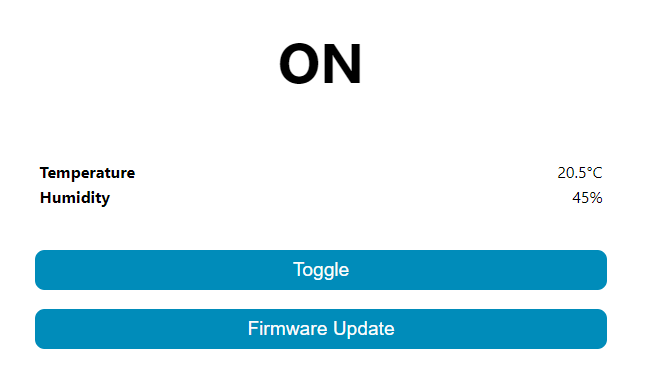
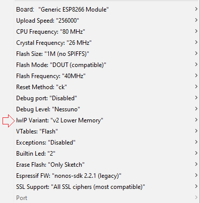

# ESPEGI
Espegi is an alternative firmware for ESP8266 based devices like iTead Sonoff with web UI, OTA updates, and Blynk support.
<br><br>
&nbsp;&nbsp;&nbsp;&nbsp;&nbsp;&nbsp;&nbsp;&nbsp;&nbsp;&nbsp;

<br><br><br>
# Features
Espegi is mainly focused on controlling a Sonoff, but with simple tweaks (in the config.h file) can be adapted to any ESP8266 based device.
##### Web UI
The first feature is the Web UI (insipred by the famous tasmota firmware). Is simple as possible, you just got the status of the relay, the temperature and humidity (if you have a sensor), a toggle button and the OTA upgrade button.<br>


##### Blynk
Obviously, since it has Blynk support you can controll it through the app (by default the relay pin is V0, but you can change it).

##### Scripting / Command line
Another feature is the ease of control through scripting languages and/or command line:
1. You can easily toggle the relay with ```<IP address>/togglecmd```
2. You can get the current temperature by typing ```<IP address>/temperaturecmd```, in "text/plain" format<br> (ex. ```26.30°C, 42.10%```)

You can find examples in the "example scripts" folder.

---

# How to install
Flashing is quite easy (if you need more information look up tasmota flashing on google):

1. Download the repo
2. Edit the config.h file with your data (WiFi SSID, password, Blynk key, etc.); more information on this later.
3. Open the Arduino IDE and install the required board/libraries

#### Install ESP8266 board software
- Open Arduino IDE and select ```File``` → ```Preferences``` (```Arduino``` → ```Preferences``` on Mac) and add the following text for field Additional Boards Manager URLs: ```http://arduino.esp8266.com/stable/package_esp8266com_index.json``` and select OK.
- ```Open Tools``` → ```Boards..```. → ```Boards Manager...``` and scroll down and click on esp8266 by ESP8266 Community. Click the Install button to download and install the latest ESP8266 board software. Select Close.
<br><br>
4. Install the Blynk library (```Sketch``` → ```#include library``` → ```Manage libraries```), and if you need it, the DHT and Adafruit Unified Sensor library.
5. Follow this flash settings, and upload the firmware (if you need to upload to a sonoff, before plugging it into the PC you have to put it in flash mode, by holding down the button while plugging it in). Surely the most important settings are: "Flash size", "Flash Mode" and "IwIP Variant". Set them right or the firmware might not work.<br><br>

6. Finished! Now look up on the router for the new IP address (Hostname: ESPEGI), type it in a browser, and you'll find the Web UI!

---

# Config file
The configuration file (the only you have to change) is fairly easy:

If you want a DHT sensor, leave it like this, otherwise comment it out with ```//```<br>
```#define DHT_SENSOR```

Blynk auth key:<br>
```char auth[] = "";```

Thingspeak API key (only if you use a DHT sensor):<br>
```String TS_API_KEY = "";```

Wi-Fi Details:<br>
```
char ssid[] = "";
char wifiPassword[] = "";
char HOSTNAME[] = "ESPEGI";

String ota_username = "admin";
String ota_password = "admin";
```

Finally you have the ESP8266 pins (RELAY_PIN, LED_PIN, etc...), and the Blynk's virtual pins (RELAY_VPIN, etc...)

---

# Contributors
[regi18](https://github.com/regi18/)

## License

[](https://www.gnu.org/licenses/gpl-3.0)

